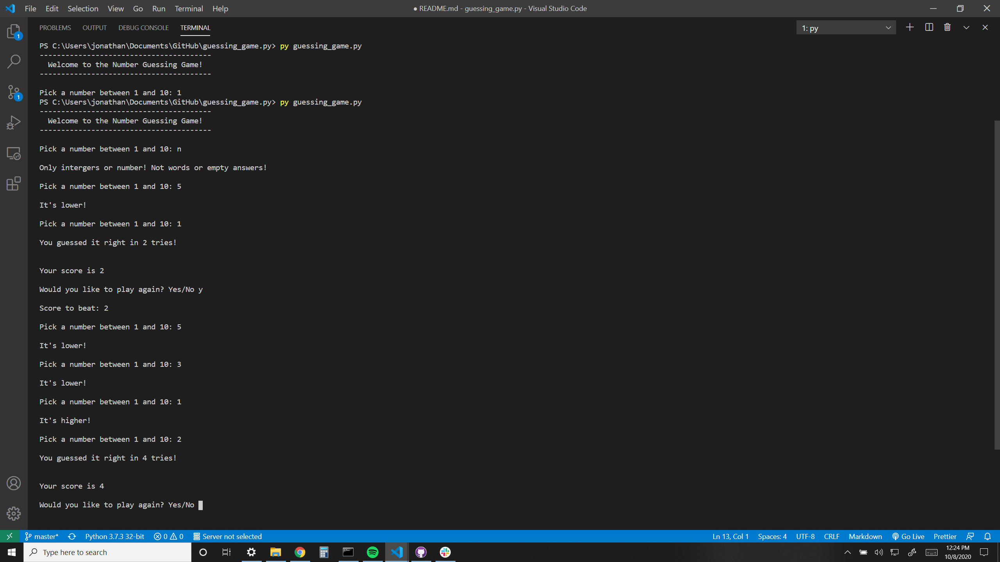

# Guessing Game W/ Python

A console number guessing game that prompts a player to choose a number between a specified range of numbers.

# Summary

My first project with Python Programming languange. Although challenging, handling errors but worth the time. Simple project, testing my newly learned skills and working with Python Enviroment, i could say i fell for Python Syntax.

# Author

**Jonathan Jimenez** - Full Stack Software Developer [LinkedIn](https://www.linkedin.com/in/jonathan-jimenez101/) | [Website](https://www.jonathanjimenez.tech)
